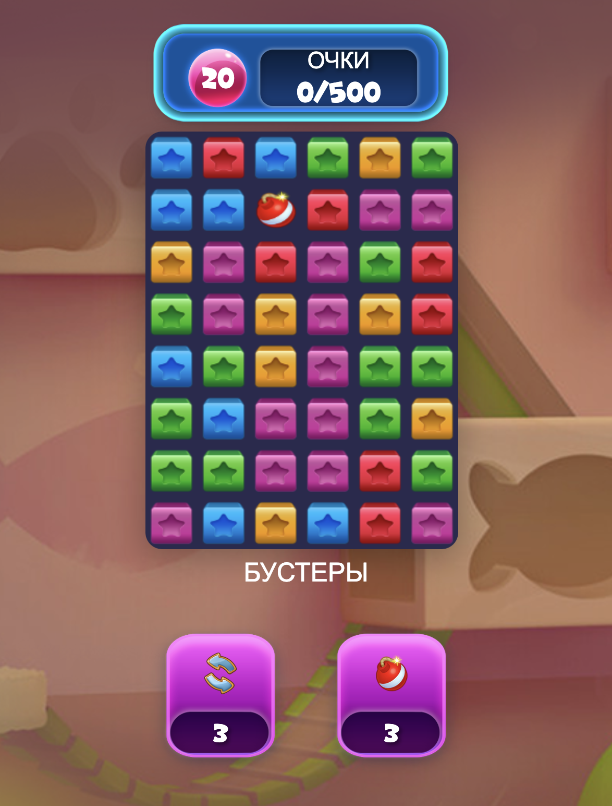

# 🎮 Blast Game - TypeScript + Cocos Creator 2.4.x




### **Технологический стек:**
- ✅ **TypeScript**
- ✅ **Cocos Creator 2.4.x**
- ✅ **Webpack**
- ✅ **ESLint**
- ✅ **Babel**

#### **Классы и компоненты:**
- ✅ **GameManager** - основной менеджер игры (Single Responsibility)
- ✅ **BoardManager** - управление игровой доской
- ✅ **TileManager** - управление тайлами
- ✅ **ScoreManager** - управление счетом и ходами
- ✅ **BoosterManager** - управление бустерами
- ✅ **AnimationManager** - управление анимациями
- ✅ **UIManager** - управление пользовательским интерфейсом
- ✅ **EventManager** - система событий


### **5. Команды:**
```bash
# Установка зависимостей
npm install

# Сборка проекта
npm run build

# Разработка с hot reload
npm run dev

# Запуск dev сервера
npm start

# Линтинг
npm run lint
```
